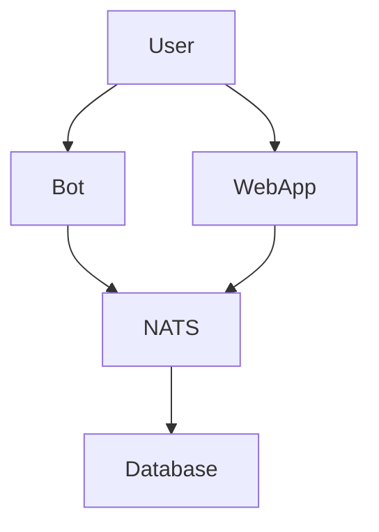

<div align="center">

# Mirth
🌸 An elegant order processing system based on <strong>event-driven architecture (EDA)</strong> with <strong>modular microservices</strong>

</div>

## ✨ Features

## 📦 Installation

### 🦭 Podman
This Podman image is published on Docker Hub.

### ❄️ Nix

### Default
`1` Clone the repository

## 🏛️ Architecture


### Tree Structure
```sh
    Hello!
```
