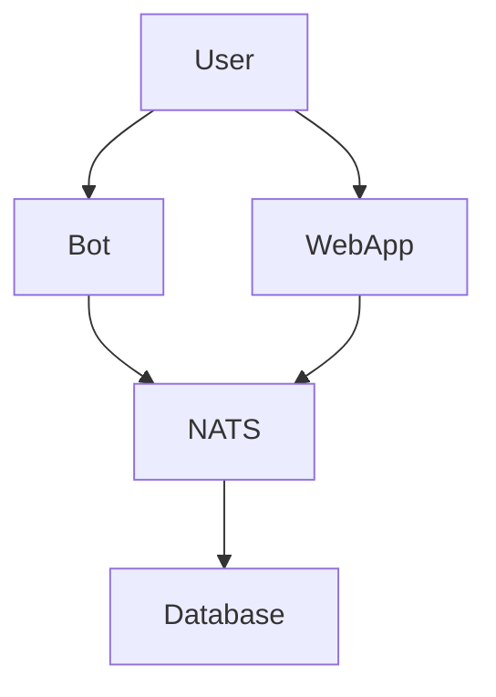

<div align="center">

# Mirth
🌸 An elegant order processing system based on <strong>event-driven architecture (EDA)</strong> with <strong>modular microservices</strong>

</div>

## ✨ Features
- Automatic generates reports
- ...

## 📦 Installation
> [!WARNING]  
> Please fill data `.sectrets.toml` which must locates in there.

### 🦭 Podman
This Podman image is published on Docker Hub.

`1` Pull from Docker Hub
```
podman pull ...
```

`2` Bring up containers
```
podman-compose up
```

### ❄️ Nix

`1` Clone this Repository via Git
```shell
git clone https://github.com/Markushik/mirth.git
```

`2` Build up Nix environment
```shell
nix develop
```

> [!TIP]
> In every services we can see file `Taskfile` which provides more flexible interaction

## 🏛️ Architecture


### Tree Structure
```shell
    Some structure
```

## ☑️ ToDo
- [ ] Integration `etcd` in system
- [ ] Add debug tools in project
- [ ] Integration `SeaweedFS` in system
- [ ] Add `sulguk` in Telgram Bot
- [ ] Config `pre-commit`, CI
